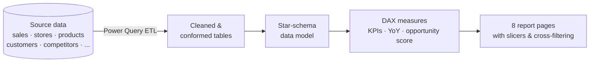

# GreenGrowth Retail — Executive Expansion Dashboard

> A Power BI executive dashboard that turns five years of retail data into a ranked shortlist of **where to open the next store**.

<p align="center">
  
  
  
  
  
</p>

---

## Overview

**GreenGrowth Retail** is a garden & plant retail chain evaluating where to open its next store. This Power BI report delivers an **8-page executive briefing** that consolidates revenue, product, geography, store, competitor, customer, and operations data into a single board-ready view — and ranks candidate markets for expansion.

It is built on a **star-schema data model** with dedicated **DAX measures** and slicers, so every visual on every page responds consistently to any combination of **Year × State × Store type**.

> **Scope of the model:** ~**$43.9M** revenue · **250,000** orders · **530,688** units · **25** stores · **10** states · **15,000** customers · **170** tracked competitors · FY2021–2025.

---

## Demo

<!--
  GitHub renders an uploaded .mp4 as an inline video player.
  To add yours: drag a video file into the GitHub README/issue editor,
  then paste the generated https:/

/github.com/user-attachments/assets/... link below.
-->
<p align="center">
  <video src="https://github.com/user-attachments/assets/61c38206-79ee-44e5-b910-05c0e65e84d3" controls width="90%"></video>
</p>

<!-- YouTube alternative: uncomment and replace IDs
[](https://youtu.be/YOUR_VIDEO_ID)
-->

---

## Features

- **8 report pages, 30+ visuals** — a complete board pack from company overview to a ranked expansion scorecard.
- **Consistent cross-filtering** — Year, State, and Store type slicers filter all visuals, KPI cards, and tables across every page.
- **Star-schema model** — a clean, performant design with the sales fact table surrounded by conformed dimensions.
- **DAX-driven metrics** — revenue, orders, AOV, YoY, segment value, and a custom opportunity score, all reconciled to the source.
- **Expansion scorecard** — ranks candidate markets using a weighted model (**60% market size / 40% competitive white-space**).
- **Geospatial analysis** — revenue mapped by state to reveal concentration and gaps.
- **Board-ready design** — a restrained "botanical" theme with tabular KPI figures, suitable for CEO/board presentation.

---

## Report Pages

| # | Page | What it answers |
|---|------|-----------------|
| 1 | **Company Overview** | Trading performance — revenue trend, revenue vs. orders seasonality, category contribution waterfall, and a revenue-by-state map. |
| 2 | **Product Mix** | Which categories and sub-categories drive the top line. |
| 3 | **Revenue by Geography** | Revenue concentration by city and state, rank movement over time, and a state→city breakdown. |
| 4 | **Store Performance** | Store and format comparison, store maturity vs. revenue, and a full store table. |
| 5 | **Competitive Landscape** | Our footprint vs. tracked competitors, distance-vs-scale analysis, and white-space markets. |
| 6 | **Customer Demand** | Revenue, reach, and loyalty by customer segment. |
| 7 | **Operational Readiness** | Service ratings, positive-feedback rate, low-stock exposure, and supplier reliability. |
| 8 | **Expansion Scorecard** | Ranked candidate markets, a scorecard table, a recommendation, and an illustrative rollout timeline. |

---

## Architecture

Raw data is shaped in **Power Query**, modeled as a **star schema**, and surfaced through **DAX measures** on the report pages.



---

## Data Model

A classic star schema with `sales` as the fact table and conformed dimensions.

<p align="center">
  <!-- Add a screenshot of your Power BI Model view (star schema) -->
  
</p>

| Table | Role | Notable fields |
|-------|------|----------------|
| `sales` | Fact (250K rows) | Revenue, Quantity, Discount, dates, keys |
| `stores` | Dimension (25) | State, City, StoreType, OpenDate |
| `products` | Dimension | Category (6), SubCategory (24), Brand, prices |
| `customers` | Dimension (15K) | CustomerSegment (4), LoyaltyPoints, City/State |
| `Date` | Date dimension | Year, Month, Quarter (marked as date table) |
| `competitors` | Reference (170) | City, State, DistanceMiles, AnnualRevenueEstimate |
| `suppliers`, `employees`, `inventory`, `feedbacks`, `campaigns` | Support | reliability, performance, stock, ratings |

**Slicer dimensions:** Year (2021–2025), State (10), Store type (Flagship / Urban / Suburban / Outlet).

---

## Slicers & Interactivity

- **Three slicers** — Year, State, and Store type — filter the entire report.
- **Default view shows all data**; select one or more values to narrow, across any combination of dimensions.
- **Cross-filtering** keeps every KPI, chart, and table in sync on each page.
- A **Clear all slicers** control returns to the full view.

---

## Key DAX

Core measures (illustrative):

```DAX
Total Revenue = SUM ( sales[Revenue] )

Orders = DISTINCTCOUNT ( sales[SaleID] )

Avg Order Value = DIVIDE ( [Total Revenue], [Orders] )

Revenue YoY % =
VAR Prev = CALCULATE ( [Total Revenue], DATEADD ( 'Date'[Date], -1, YEAR ) )
RETURN DIVIDE ( [Total Revenue] - Prev, Prev )
```

Opportunity score used on the scorecard page:

```
score = ROUND( (marketSize * 0.60 + whiteSpace * 0.40) * 100 )
  marketSize = city avg competitor revenue / max across candidate cities
  whiteSpace = 1 - (city competitor count / max competitor count)
  candidate  = a competitor city with no existing GreenGrowth store
```

---

## Tools

- **Power BI Desktop** — modeling, DAX, and report authoring
- **Power Query (M)** — data cleaning and shaping
- **DAX** — measures, time intelligence, and the opportunity model
- **Filled map / shape map** — geospatial revenue view
- **Custom report theme** — the botanical color palette

---

## Design

- **Palette:** deep evergreen + ivory with a single restrained brass accent for opportunity/candidate callouts.
- **KPI cards:** large tabular figures for at-a-glance reading.
- **Layout:** consistent navigation, a KPI band, and a balanced chart grid on every page.


---

## Author

**Your Name** — [LinkedIn](https://linkedin.com/in/your-handle) · [Portfolio](https://your-site.com)

> If you found this useful, consider giving the repo a ⭐.
